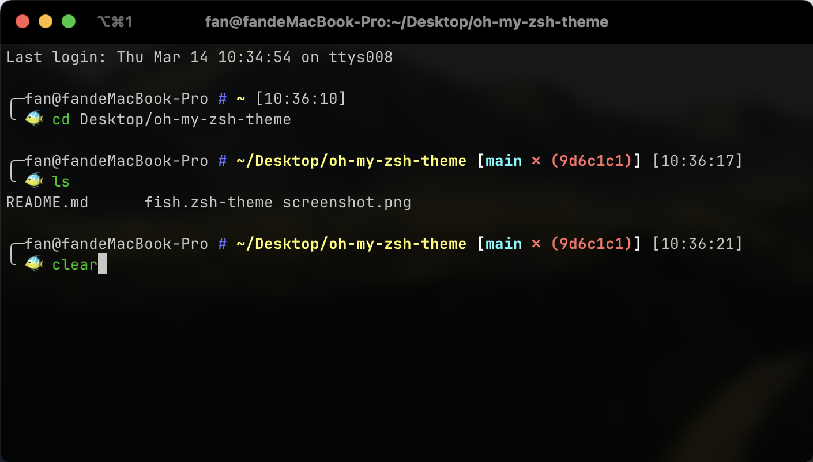

# fish.zsh-theme
A simple oh-my-zsh theme with username, current directory, and git version number.

In order to make the terminal no longer monotonous, the command line starts with a fish.

## Installation

```bash
curl https://raw.githubusercontent.com/sbfkcel/oh-my-zsh-theme/main/fish.zsh-theme -o ~/.oh-my-zsh/themes/fish.zsh-theme
```

## Install

- Change the theme variable name to `ZSH_THEME="fish"` in `~/.zshrc`
- Reload ZSH with source `~/.zshrc`

## Screenshot


## License

MIT